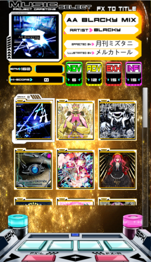
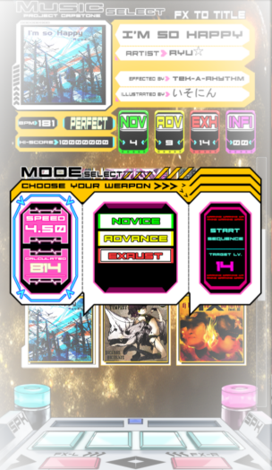
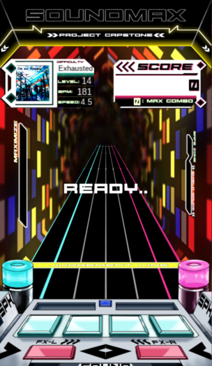
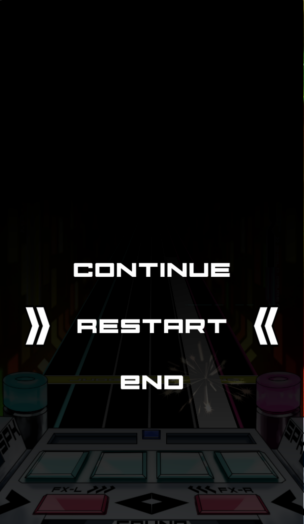

# UnitySoundMax

* This program was provided as a result of the Capstone project.
  It is clear that some of the codes are still used for the [Unnamed SDVX clone](https://github.com/Drewol/unnamed-sdvx-clone), so it should be considered.

* This program is an launcher that reads the `KShoot charts(*.ksh)` file and helps you enjoy the game in the same way as [SDVX](https://remywiki.com/What_is_SOUND_VOLTEX) and [KShootMania](https://www.kshootmania.com/)
* This program was created using Unity3d 2018.3.9f1.
* NGUI, All Effects, [EasingFucntion](https://gist.github.com/cjddmut/d789b9eb78216998e95c) is not available as a 3rd party.

## Demo Video

## Usage

* It is recommended to use [Unnamed SDVX clone](https://github.com/Drewol/unnamed-sdvx-clone) for general gameplay.
  * The project has many experimental elements.
  * Since the music load time optimization and caching were not done at all, it takes an extremely long time to run.
  * Nevertheless, if you want to use the program, please refer to the instructions below.
* If you build this Unity Project successfully, You can see the folder named `SoundMax_Data` inside the folder that contains the `.exe extension` file.
* The folder include `ksh extension` files must be located in the `SoundMax_Data/StreamingAssets/Music` folder.
  * `BuildFolder/SoundMax_Data/StreamingAssets/Music/KSHFolder`
* When the exe file is executed, the files located in the above path are read and displayed in the music select menu.

## Description

* The basic gameplay is the same as `SDVX`.

* The Key mapping is as follows.
  * Start Button : `V`
  * Normal Button : `A`, `S`, `D`, `F`
  * FX Button : `Z`, `X`
  * Left Laser Knob : mouse X-axis (mouse) or `Q`, `W` (keyboard)
  * Right Laser Knob : mouse Y-axis (mouse) or `E`, `R` (keyboard)
  * Laser Knob mouse <-> keyboard convert : `P` (Only works in-game)
  * Auto Play : `C`
  * Maximize Button : `B`
* Details
  * The `laser knobs` are basically mapped to the mouse.
  * In the Maximaize mode, all judgments are changed to `DMAX`.
  * If you hold down the `Maximize button` during the game, the gauge fills up quickly.
* Panel Manual
  * Common to all panels, the `Start button` moves to the next panel, and the `FX button` moves to the previous panel.
  
| Panel Screenshot | Description  |
| ----- | ----- |
|  | Use the `Left Laser Knob` to control the cursor.   Use the `Start button` to advance to the next panel.   Use the `FX button` to go to the previous panel. |
| 

 | Use the `Left Laser Knob` to control the mode cursor.   Use the `Right Laser Knob` to select detail cursor. |
|  | If you press the `Start button` during ingame,   you can enter the `Pause panel`.   Use the `Left Laser Knob` to control the cursor. |